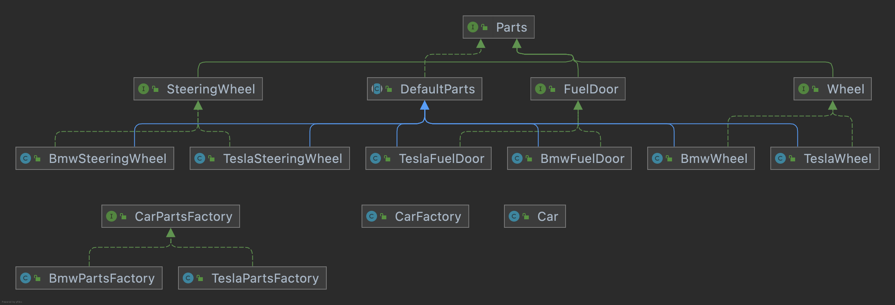

# Abstract Factory

## 목적
- 서로 연관 있는 객체 Family의 생성 책임을 갖는 인터페이스
- Factory에서 어떤 Concrete Product를 생성하는지를 클라이언트에게 숨긴다.

## Participants
- Product (Wheel, FuelDoor, SteeringWheel): 생성하고자 하는 Parts Family에 속하는 개별 객체
- Factory (CarPartsFactory): Product를 생산해내는 부품 공장  
- Client (CarFactory) : CarPartsFactory에게 부품을 받아 Car를 생산

## 구현
1. Wheel, SteeringWheel, FuelDoor 라는 3개의 Part-products를 만드는 CarPartsFactory 인터페이스를 정의한다. 
```java
public interface CarPartsFactory {

    Wheel createWheel();

    SteeringWheel createSteeringWheel();

    FuelDoor createFuelDoor();

}
```

2. 3개의 Parts에 대한 인터페이스를 정의한다. 
```java
public interface FuelDoor {

    void open();

    void close();

    void charge();

}

public interface SteeringWheel {

    void steer();

}

public interface Wheel {

    void rotate();

}
```

3. Concrete factory를 정의한다. Tesla 부품 공장에서는 Tesla Parts를 생산하는 메서드들이 필요할 것이다. BMW 부품 공장이라면 BMW Parts를 생산하도록 한다.
```java
public class TeslaPartsFactory implements CarPartsFactory {

    @Override
    public Wheel createWheel() {
        return new TeslaWheel();
    }

    @Override
    public SteeringWheel createSteeringWheel() {
        return new TeslaSteeringWheel();
    }

    @Override
    public FuelDoor createFuelDoor() {
        return new TeslaFuelDoor();
    }
    
}
```

4. 3개의 Concrete product를 정의하고, Abstract methods를 실제로 구현해준다.
```java
public class TeslaSteeringWheel implements SteeringWheel {

    @Override
    public void steer() {
        System.out.println("Steering Tesla");
    }

}
```

5. 클라이언트인 CarFactory는 CarPartsFactory 인터페이스를 DI 받도록 한다. Car 객체에 들어가는 부품을 생성하기 위해 CarPartsFactory의 create 메서드들을 호출한다.
```java
public class CarFactory {

    private final CarPartsFactory partsFactory;

    public CarFactory(CarPartsFactory partsFactory) {
        this.partsFactory = partsFactory;
    }

    public Car create() {
        Wheel wheel = this.partsFactory.createWheel();
        SteeringWheel steeringWheel = this.partsFactory.createSteeringWheel();
        FuelDoor fuelDoor = this.partsFactory.createFuelDoor();

        return new Car(wheel, steeringWheel, fuelDoor);
    }

}
```

6. 자동차 부품의 제조사가 어디인지 알려주는 메서드가 있었으면 좋을 것 같다. 예를 들어, 제조사가 Tesla라면 모든 Parts들의 manufacturer는 "TESLA"라는 값을 가지고 있는 식이다. 이를 위해 모든 Product에 Field와 Getter를 추가해야 할까?  
```java
public class TeslaSteeringWheel implements SteeringWheel {

    private final String MANUFACTURER = "TESLA";
    
    ...
    
    @Override
    String getManufacturer() {
        return this.MANUFACTURER;
    }
    
}
```

7. 6번처럼 구현한다면 똑같은 로직의 중복이 모든 Product 내에서 발생할 것 같다. Product들은 공통적으로 "자동차의 부품"이므로, Product의 인터페이스 상위에 Parts라는 인터페이스를 두자. Parts를 상속하는 Abstract class도 만든 후, manufacturer 필드를 추가한다. 
```java
public interface Parts {

    String getManufacturer();

}

public interface SteeringWheel extends Parts {

    void steer();

}

public abstract class DefaultParts implements Parts {

    private String manufacturer;

    public DefaultParts(String manufacturer) {
        this.manufacturer = manufacturer;
    }

    // hook methods
    @Override
    public String getManufacturer() {
        return this.manufacturer;
    }

}

```

8. 이후, Concrete products에 생성자에서, 수퍼클래스인 DefaultParts의 생성자 인자로 "TESLA"를 넘겨준다.
```java
public class TeslaSteeringWheel extends DefaultParts implements SteeringWheel {

    public TeslaSteeringWheel() {
        super("TESLA");
    }
    ...
}
```

9. 테스트를 해보자. getManufacturer()로부터 "TESLA" 스트링을 받아올 수 있다.
```java
@Test
void run() {
    CarFactory teslaFactory = new CarFactory(new TeslaPartsFactory());
    Car tesla = teslaFactory.create();

    assertThat(tesla.getFuelDoor().getManufacturer()).isEqualTo("TESLA");
    assertThat(tesla.getWheel().getManufacturer()).isEqualTo("TESLA");
    assertThat(tesla.getSteeringWheel().getManufacturer()).isEqualTo("TESLA");
}
```

10. 구현된 최종적인 구조는 아래와 같다.



## 팩토리 메서드 패턴과의 공통점/차이점
### 공통점
- WIP
### 차이점
- WIP  