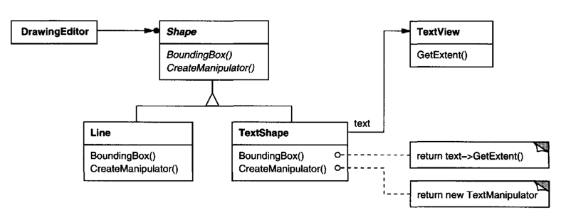
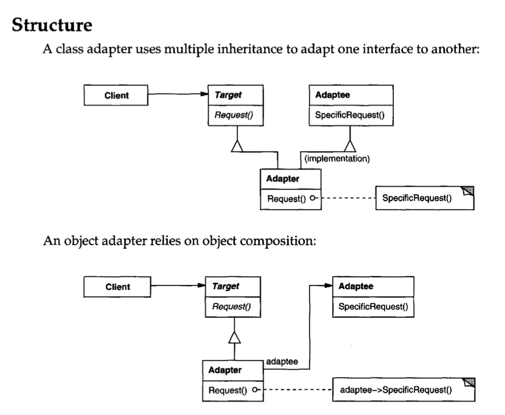

## Intent
- 클래스의 인터페이스를 클라이언트가 기대하는 다른 인터페이스로 변환
- 호환되지 않는 인터페이스를 서로 호환되게 함

## Also Known As
- Wrapper

## Motivation
그림 편집기는 선, 도형, 텍스트를 넣을 수 있다. 이러한 Graphical objects를 위한 _Shape_ 인터페이스를 정의하자. LineShape, PolygonShape, TextShape 등등이 서브클래싱 될 것이다.
이중에서 TextShape는 조금 이상하다. 일반적인 도형의 편집과 성격이 다르기 때문이다 (화면 업데이트, STD I/O 버퍼 관리 등).
텍스트를 관리하기 위한 목적을 가진 TextView 인터페이스가 있다고 하자. TextShape를 구현할 때 TextView를 재사용한다면 쉽게 구현이 될 것 같지만, 두 인터페이스는 호환이 되지 않는다.

이러한 문제를 해결하기 위해, 두 인터페이스 간 코드 수정 없이 호환을 가능하게 하는 디자인 패턴이 Adapter 패턴이다. 다음은 TextShape를 Adapter로 활용하는 두 가지 방법이다.
- TextShape가 Shape의 인터페이스와 TextView 구현을 상속하도록 한다. (Class adapter)
- TextShape에서 TextView 인스턴스를 사용하고, TextView 인터페이스를 바탕으로 TextShape을 구현한다. (Object adapter)

```java
public interface ClassAdapter extends Target implements Adaptee {
    void targetMethod() {
        adapteeMethod();
    }
}

public interface ObjectAdapter extends Target {
    private Adaptee adaptee;
    
    void targetMethod() {
        adaptee.doMethod();
    }
}
```



위 다이어그램은 Object adapter를 보여준다. TextShape는 Shape 인터페이스를 상속하며, TextView의 인스턴스인 text를 사용한다.
BoundingBox() 메서드에 대해 text.getExtent() 메서드를 호출하도록 구현되었다.

## Applicability
- 사용하고자 하는 클래스가 인터페이스와 호환되지 않을때 
- 연관성이 없는 클래스와 협력하는 클래스를 재사용이 쉽게 만들고 싶을 때

## Structure


## Participants
- Target (Shape)
  - 클라이언트가 사용하는 특정 도메인의 인터페이스를 정의
- Client (DrawingEditor)
  - 타겟 인터페이스를 준수하는 객체를 사용하는 클라이언트
- Adaptee (Textview)
  - 타겟과 호환되지 않아 Adapting이 필요한 인터페이스
- Adapter (TextShape)
  - Adaptee를 타겟과 호환시킴

## Summary
- 타겟 인터페이스와 Adaptee 간의 코드 수정 없이 연결하고자 할 경우 사용
- 기존 코드를 유지하며 Adapter를 통한 확장 (OCP)
- 스프링 시큐리티의 UserDetails, 자바의 List.asList 등 